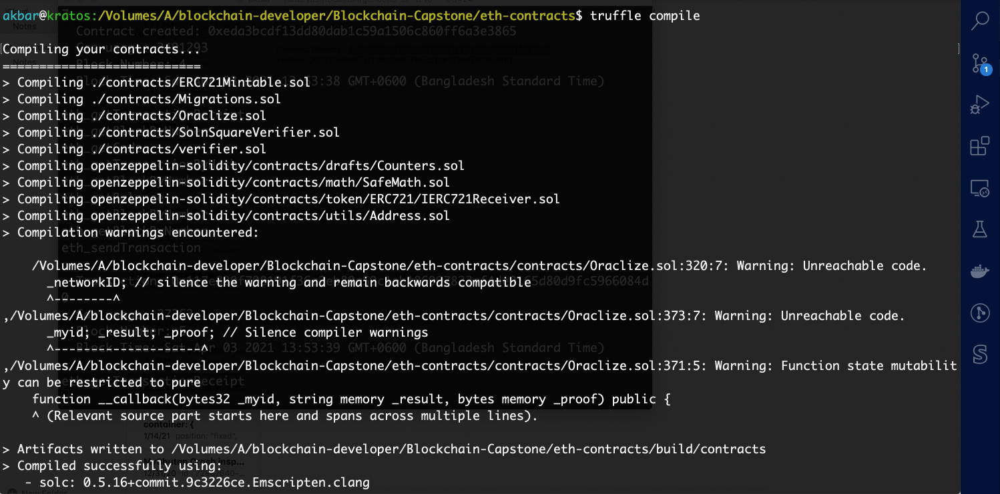
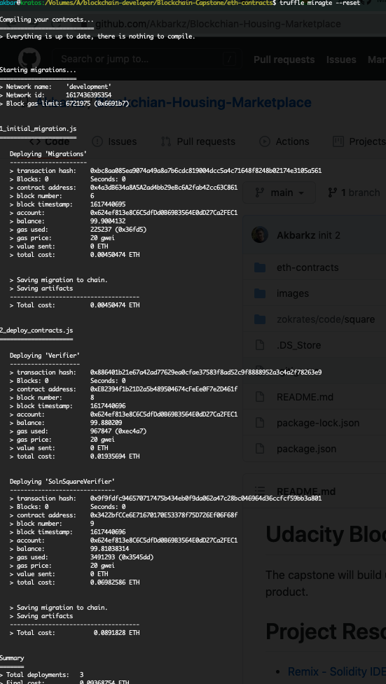
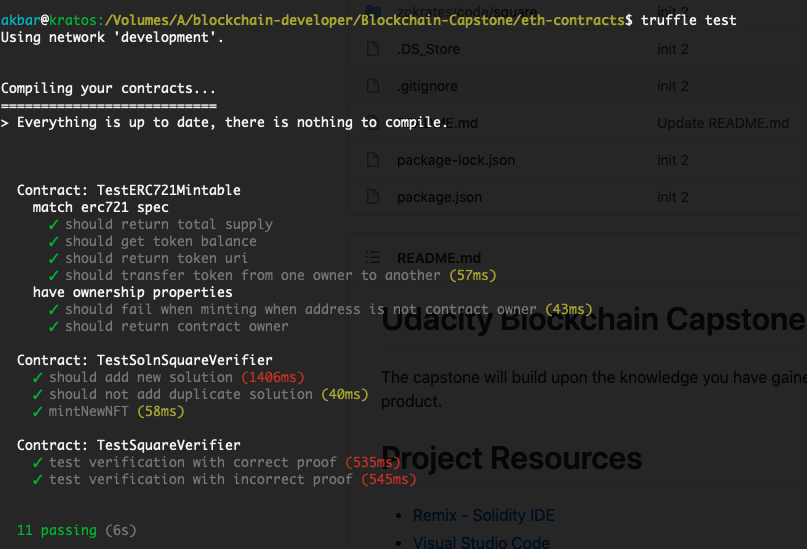
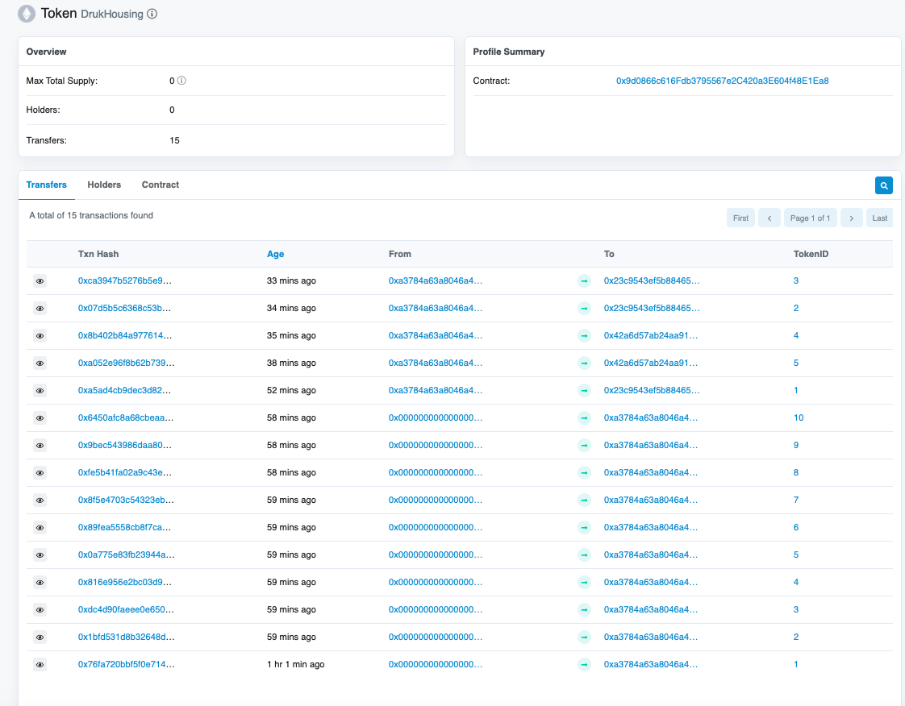
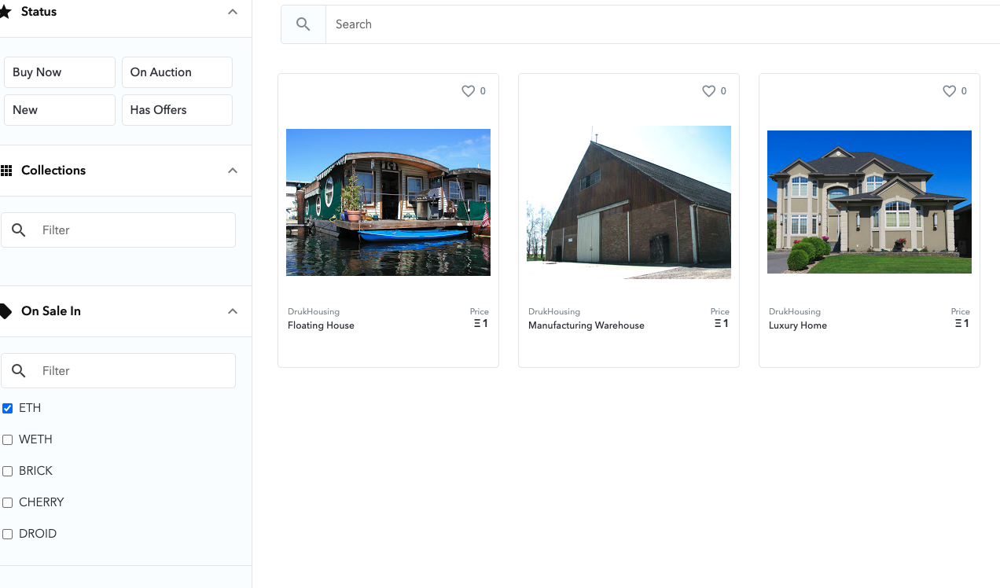
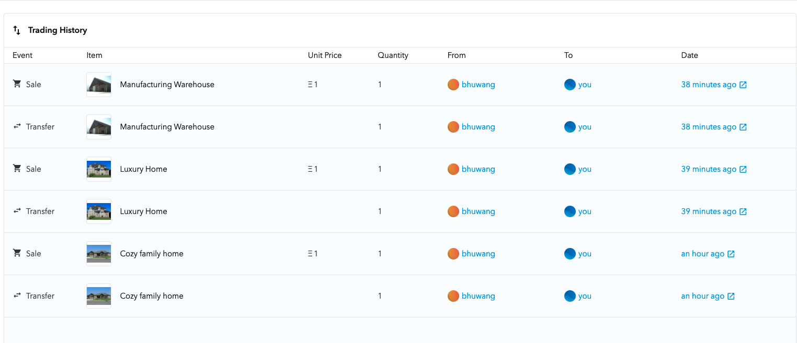

# Decentralized Housing Marketplace

At present, property titles are often paper-based, creating opportunities for errors and fraud. Title professionals find defects in 25% of all titles during the transaction process, according to the American Land Title Association.
Any identified defect makes it illegal to transfer a property title to a buyer until it is rectified. This means property owners often incur high legal fees to ensure authenticity and accuracy of their property titles.
These title management issues could potentially be mitigated by using blockchain technology to build immutable digital records of land titles and using blockchain for transparent transactions. This approach could simplify property title management, making it more transparent and helping to reduce the risk of title fraud and the need for additional insurance.

The project implements ERC721 specification for token. The owner has to verify the ownership of the property before minting the token. 
The verification of the property is done using zk-SNARKs and zokrates.

## Dev Tools Version

The project was developed with  following tools/softwares.
1. Truffle v5.1.54
2. Solidity v^0.5.16
3. nodejs v12.13.1
5. Metamask Chrome Extension
6.VS Code

## Getting Started

These instructions will get you a copy of the project up and running on your local machine for development and testing purposes

### Prerequisites

Please make sure you've already installed ganache-cli, Truffle, Solidity, nodejs  and enabled MetaMask extension in your browser.

### Installing

A step by step series of examples that tell you have to get a development env running

Clone this repository:

```
git clone https://github.com/Akbarkz/Blockchian-Housing-Marketplace.git
```

Install dependencies and libraries:
```
npm install
```

Launch Ganache: 

```
ganache-cli -a 10

```


In a separate terminal window, Compile smart contracts:

```
cd eth-contracts
truffle compile
```

Your terminal should look something like this:



This will create the smart contract artifacts in folder `build\contracts`.

Migrate smart contracts to the locally running blockchain, ganache-cli:

```
truffle migrate --reset
```

Your terminal should look something like this:



Test smart contracts:

```
truffle test
```

All 11 tests should pass.




#Deploy to Rinkeby Network

1. Copy .env-sample and rename it to .env
2. Add MNEMONIC and INFURA_API_KEY values.

* [Infura API Key for Ethereum - Registration and Usage Guide](https://ethereumico.io/knowledge-base/infura-api-key-guide/)

Run below command

```
truffle migrate --network rinkeby

```


## Rinkbey Deployment Details

1. Contract Address : https://rinkeby.etherscan.io/address/0x9d0866c616Fdb3795567e2C420a3E604f48E1Ea8
   2.Transaction :https://rinkeby.etherscan.io/tx/0xd2119c6e6af84fdca37d2f134c5c488b771542242e54deed8bc1463276047986

## How to mint tokens after deployment to rinkeby

https://www.youtube.com/watch?v=8MChn-NJJB0

## Token Details
https://rinkeby.etherscan.io/token/0x9d0866c616Fdb3795567e2C420a3E604f48E1Ea8



https://testnets.opensea.io/assets/drukhousing
## Opensea Marketplace


### List for sale 




### Buy token from another address




# Project Resources

* [Remix - Solidity IDE](https://remix.ethereum.org/)
* [Visual Studio Code](https://code.visualstudio.com/)
* [Truffle Framework](https://truffleframework.com/)
* [Ganache - One Click Blockchain](https://truffleframework.com/ganache)
* [Open Zeppelin ](https://openzeppelin.org/)
* [Interactive zero knowledge 3-colorability demonstration](http://web.mit.edu/~ezyang/Public/graph/svg.html)
* [Docker](https://docs.docker.com/install/)
* [ZoKrates](https://github.com/Zokrates/ZoKrates)
